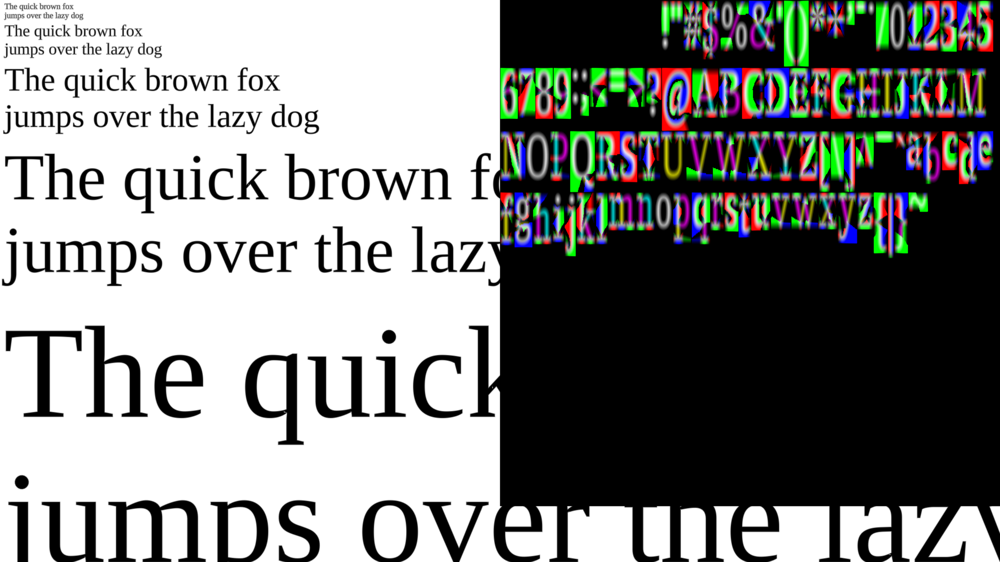
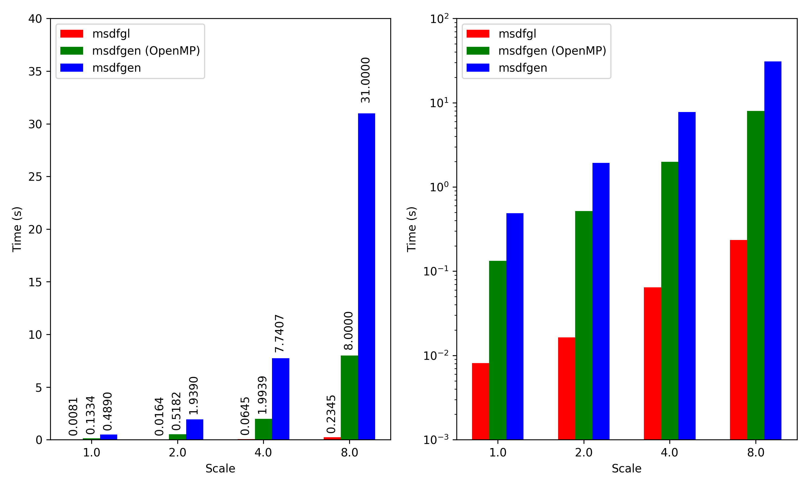
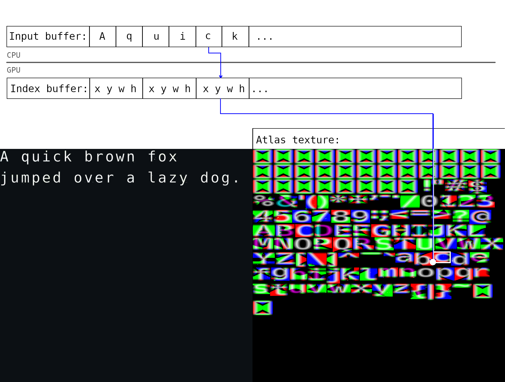

# MSDFGL - OpenGL-accelerated implementation of the multi-channel signed distance-field algorithm.



The MSDF algorithm implemented in this library was created by Viktor Chlumský (https://github.com/Chlumsky/msdfgen). Details about the implementation and the benefits of MSDF can be read from his repository or his thesis. MSDFGL is a GPU-accelerated implementation of his algorithm, and it was written from scratch in C.

The code had to go through quite a bit of modifications to make it runnable on the GPU:
1. It's no longer object-oriented
2. It now runs with constant memory (which is a requirement in shaders)
3. It does not use pointers
4. Dropped support for cubic segments (for simplicity's sake, this can probably be added later)

For now tested only with OpenGL ES 3.2 on Wayland EGL, and OpenGL 3.3 Core with glfw3, on Linux with Wayland, with Intel UHD Graphics 620, and on macOS Mojave on Macbook Pro 2015 (Iris Pro), and on Windows 10 with Intel HD Graphics 515. (Funny, I seem to currently own only Intel graphics cards...)

## Performance
The following plot shows performance comparisons to `msdfgen`. The benchmark consists of generating an MSDF texture from ASCII (0 - 127) characters for font `DejaVu Sans`. It was performed with a Core i7 8550m and Intel UHD Graphics 620, on Debian Linux. Each time was calculated by taking an average of a 100 executions, and canceling out the time for glfw to create and destroy the OpenGL context. 

> As the shader is quite complex, it's compilation takes close to a second. However, after one compilation, the user can create as many font textures as they want. Time to compile the shader is not included in the following comparisons.

The plot on the right has the exact same data, just with a logarithmic y-axis.



> Values 8.0000 and 31.0000 for 8.0x msdfgen were extrapolated, as the CPU implementation scales quadratically (+ I didn't want to torture my Dell's CPU anymore...)

There seems to be some caching going on with the Intel driver on Linux, as the shader compilation seems to be instantaneous if the binary had been run before. First I thought that the resulting atlas texture was being cached, but generating the the texture was still fast to a font that msdfgl had never seen before. The caching behavior was not seen on macOS.

With `msdfgen` the measurement did not include the time to transfer the resulted bitmaps to a texture, whereas with `msdfgl` after the execution the font was ready to be rendered with.


## Implementation
The highly parallelizable part of MSDF algorithm has been moved to run on the GPU (the part of msdfgen which is executed per each pixel of the bitmap).

A loaded msdfgl font has two textures:
- Atlas texture - 2D RGBA texture containing all the generated MSDF bitmaps
- Index texture - 1D FLOAT texture buffer containing the coordinates and dimensions of each glyph on the atlas texture (there is also information about the bearing of the glyph so that we do not have to store the bitmap all the way from the origin, only from where the glyph actually starts).

Both the atlas and index textures grow as more glyphs are rendered. The user can render all the desired glyphs in bulk, or render them dynamically as new glyphs are introduced. -- Or a combination of those, for example render ASCII characters at the beginning, and then all the other characters as they are used. Rendering multiple characters at once yields better performance as we don't have to perform multiple copy-to-GPU operations nor to re-bind the buffers and shader in between.



## Installation:

### Linux and macOS
The lib will be installed in `/usr/local/lib`, and the header into `/usr/local/include`.
```sh
mkdir build
cd build
cmake ..
make
sudo make install
```

### Windows
I tested that the compilation can be done and the example works on Windows with 32-bit MSVC 2019.

In `CMakeLists.txt` modify variables `FREETYPE_DIR` and `GLFW3_LIB` to point to an existing freetype2 install and to glfw3 library file. 32-bit and 64-bit freetype 2.10 are included in the repository for convenience.

```sh
mkdir build
cd build
cmake -G "Visual Studio 16 2019" ..
cmake --build .
```

## Usage:

An example is provided in `example`-directory. It can be compiled (requires glfw):
```sh
# In the cmake build directory
make msdfgldemo  # nmake instead of make on Windows
```
...and run:
```sh
./msdfgldemo /path/to/font/file.ttf "Hello, MSDFGL!"
```

### Usage as a library:
```C
#include <msdfgl.h>

msdfgl_context_t context;
context = msdfgl_create_context(NULL);  /* NULL defaults to "330 core" */

msdfgl_font_t font;
font = msdfgl_load_font(context, "/usr/share/fonts/truetype/dejavu/DejaVuSansMono.ttf",
                        4.0, 2.0, NULL); /* range, scale, atlas (NULL creates a new one) */

/* Loads characters 0-128 onto the textures. This is where all the GPU cycles went. */
msdfgl_generate_ascii(font);

/* Enable auto-generating undefined glyphs as they are encountered for the first time. */
msdfgl_set_missing_glyph_callback(context, msdfgl_generate_glyph, NULL);

/*            x    y           size  color       4x4 projection-matrix  flags */
msdfgl_printf(0.0, 20.0, font, 18.0, 0xffffffff, (GLfloat *)projection, MSDFGL_KERNING,
              "Hello, MSDFGL v%s!", MSDFGL_VERSION);

/* Cleanup */
msdfgl_destroy_font(font);
msdfgl_destroy_context(context);
```
Then, link your binary against msdfgl:
```sh
gcc ... -lmsdfgl
```

The library includes two shaders:
- Generator shader - heavy lifting, generates the MSDF bitmaps.
- Render shader - renders crisp text from the generated textures.


## TODO:
- Detecting incorrect winding of a glyph and inverting the texture to compensate
- Edge-coloring for teardrop with 1 or 2 segments
- Support for cubic segments (needed for OpenType fonts)
